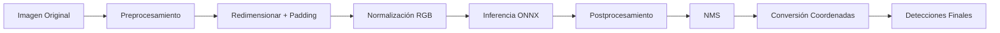

# CitrusDetector - Detección de Copas de Árboles

<div align="center">


**Sistema de detección automática de copas de árboles cítricos basado en YOLOv9 y ONNX Runtime**

Desarrollado por: Pedro Juan Torres González | z32togop@uco.es | CitriData 

Basado en el desarrollo previo de PUTVision--DeepNess
https://github.com/PUTvision/qgis-plugin-deepness?tab=readme-ov-file

[Artículo Original](https://www.sciencedirect.com/science/article/pii/S2352711023001917)

[Modelo onnx](https://chmura.put.poznan.pl/s/A9zdp4mKAATEAGu?opendetails=)

[Características](#-características) • [Instalación](#-instalación) • [Uso](#-uso-rápido) • [Estructura](#-estructura-del-proyecto) • [Notebooks](#-notebooks)

</div>

---

## 📋 Descripción


### 🎯 Aplicaciones

- 🌳 Inventario automático de árboles en plantaciones
- 📊 Análisis de densidad y distribución de cultivos
- 🗺️ Mapeo y geolocalización de parcelas agrícolas
- 📈 Monitoreo del crecimiento y desarrollo de cultivos
- 🔍 Inspección y control de calidad en campo

---

## ✨ Características

### 🚀 Características Técnicas

- **Arquitectura Modular**: Clase base `DeepNessModelProcessor` extensible para diferentes tipos de modelos
- **Optimizado para Producción**: Inferencia con ONNX Runtime para máximo rendimiento
- **Preprocesamiento Inteligente**: Mantiene aspect ratio con padding centrado
- **NMS Robusto**: Non-Maximum Suppression para eliminar detecciones duplicadas
- **Conversión de Coordenadas Precisa**: Mapeo correcto entre imagen original y detecciones
- **Visualización Integrada**: Herramientas matplotlib para visualizar resultados
- **Logging Completo**: Sistema de logging para debugging y monitoreo

### 📊 Especificaciones del Modelo

| Parámetro | Valor |
|-----------|-------|
| **Modelo** | YOLOv9 (ONNX) |
| **Input Shape** | `[1, 3, 640, 640]` |
| **Output Shape** | `[1, 5, 8400]` |
| **Formato Input** | RGB normalizado [0-1] |
| **Tipo de Detección** | Single-class (Copas de árboles) |
| **Confianza por defecto** | 0.5 |
| **NMS Threshold** | 0.4 |

---

## 🛠️ Instalación

### Prerrequisitos

- Python 3.8 o superior
- pip (gestor de paquetes de Python)
- Modelo descargado previamente [aquí](https://chmura.put.poznan.pl/s/A9zdp4mKAATEAGu?opendetails=)

### Instalación paso a paso

1. **Clonar el repositorio**
```bash
git clone https://github.com/tuusuario/based_deepness.git
cd based_deepness
```

2. **Crear entorno virtual (recomendado)**
```bash
python -m venv venv
source venv/bin/activate  # En Windows: venv\Scripts\activate
```

3. **Instalar dependencias**
```bash
pip install -r requirements.txt
```

---

## 🚀 Uso Rápido

### Ejemplo Básico

```python
from CitrusDetector import CitrusDetector_vf
import cv2

# 1. Inicializar el detector
detector = CitrusDetector_vf(
    model_path="path/to/model.onnx",
    confidence_threshold=0.5,
    nms_threshold=0.4
)

# 2. Cargar imagen
image = cv2.imread("path/to/citrus_image.jpg")

# 3. Ejecutar detección
detections = detector.detect(image)

# 4. Visualizar resultados
detector.visualize_detections(image, detections)
```

### Parámetros de Configuración

```python
detector = CitrusDetector_vf(
    model_path="modelo.onnx",           # Ruta al modelo ONNX
    confidence_threshold=0.5,            # Umbral de confianza (0-1)
    nms_threshold=0.4                    # Umbral NMS para IoU
)
```

### Procesamiento de Resultados

```python
# Las detecciones contienen:
for detection in detections:
    x1, y1, x2, y2 = detection['bbox']  # Coordenadas bounding box
    confidence = detection['confidence']  # Confianza de la detección
    class_id = detection['class_id']     # ID de clase
```

---

## 📁 Estructura del Proyecto

```
based_deepness/
│
├── CitrusDetector.py              # Clase principal de detección
├── requirements.txt               # Dependencias del proyecto
├── README.md                      # Este archivo
│
├── notebooks/
│   ├── 1_DeepNess_vf.ipynb       # Desarrollo y explicación del modelo
│   └── 2_Uso_CitrusDetector.ipynb # Tutorial de uso y ejemplos
│
└── data/                          # Directorio para datos (modelos/imágenes)
    ├── models/                    # Modelos ONNX
    └── images/                    # Imágenes de prueba
```

---

## 📓 Notebooks

El proyecto incluye dos notebooks interactivos para facilitar el aprendizaje y uso:

### 1️⃣ [1_DeepNess_vf.ipynb](1_DeepNess_vf.ipynb)

**Desarrollo y Arquitectura del Sistema**

- 🏗️ Explicación detallada de la clase `DeepNessModelProcessor`
- 🔧 Implementación paso a paso de `CitrusDetector_vf`
- 📐 Análisis de preprocesamiento y transformaciones de imagen
- 🧪 Tests y validación del modelo
- 📊 Análisis de rendimiento

**Ideal para**: Desarrolladores que quieren entender el funcionamiento interno o extender el sistema.

### 2️⃣ [2_Uso_CitrusDetector.ipynb](2_Uso_CitrusDetector.ipynb)

**Tutorial de Uso y Ejemplos Prácticos**

- 🎯 Ejemplos de uso básico
- 📸 Procesamiento de imágenes individuales
- 🔄 Procesamiento por lotes
- 🎨 Visualización avanzada de resultados
- 💡 Tips y mejores prácticas
- 🐛 Troubleshooting común

**Ideal para**: Usuarios finales que quieren usar el detector en sus proyectos.

---

## 🔧 Funcionalidades Principales

### Clase `DeepNessModelProcessor`

Clase base genérica para procesamiento de modelos ONNX:

```python
class DeepNessModelProcessor:
    """Procesador base para modelos ONNX"""
    
    def __init__(self, model_path, model_type)
    def _initialize_session()          # Inicializa ONNX Runtime
    def run_inference(preprocessed_image)  # Ejecuta inferencia
```

### Clase `CitrusDetector_vf`

Detector especializado extendido de `DeepNessModelProcessor`:

```python
class CitrusDetector_vf(DeepNessModelProcessor):
    """Detector de cítricos con YOLOv9"""
    
    def preprocess_image(image)        # Preprocesamiento con aspect ratio
    def detect(image)                  # Pipeline completo de detección
    def postprocess_detections(output) # NMS y filtrado
    def visualize_detections(image, detections)  # Visualización
```

---

## 📊 Pipeline de Detección



---

## 🎯 Preprocesamiento

El sistema implementa un preprocesamiento robusto:

1. **Conversión de color**: BGR → RGB
2. **Redimensionamiento proporcional**: Mantiene aspect ratio
3. **Padding inteligente**: Centra la imagen con padding gris (114)
4. **Normalización**: Valores [0-255] → [0-1]
5. **Formato tensor**: HWC → CHW
6. **Batch dimension**: (3, 640, 640) → (1, 3, 640, 640)

---

## 📈 Post-procesamiento

1. **Conversión de formato**: [1, 5, 8400] → [8400, 5]
2. **Filtrado por confianza**: Elimina detecciones con baja confianza
3. **Non-Maximum Suppression (NMS)**: Elimina duplicados
4. **Conversión de coordenadas**: De espacio 640x640 a imagen original

---

## 🔍 Detalles Técnicos

### Formato de Salida del Modelo

```python
# Output shape: [1, 5, 8400]
# Cada detección contiene: [x_center, y_center, width, height, confidence]
# Las coordenadas están en el espacio de entrada (640x640)
```

### Conversión de Coordenadas

```python
# De coordenadas centradas a esquinas
x1 = (x_center - width/2) / scale - x_offset
y1 = (y_center - height/2) / scale - y_offset
x2 = (x_center + width/2) / scale - x_offset
y2 = (y_center + height/2) / scale - y_offset
```

---

## 🎨 Visualización

El sistema incluye herramientas de visualización:

```python
detector.visualize_detections(
    image,
    detections,
    figsize=(15, 10),
    show_confidence=True
)
```

Características de visualización:
- 🟢 Bounding boxes con color personalizable
- 📊 Etiquetas con nivel de confianza
- 📐 Información de dimensiones
- 🎯 Contador de detecciones

---

## 📦 Dependencias Principales

| Librería | Versión | Propósito |
|----------|---------|-----------|
| `numpy` | 1.26.4 | Operaciones numéricas |
| `opencv-python` | 4.11.0 | Procesamiento de imágenes |
| `onnxruntime` | 1.17.0 | Inferencia del modelo |
| `matplotlib` | 3.10.3 | Visualización |
| `pillow` | 11.3.0 | Manipulación de imágenes |
| `pandas` | 2.3.1 | Análisis de datos |

Ver [requirements.txt](requirements.txt) para lista completa.

---

## 👤 Autor

**Pedro Juan Torres González**  
CitriData - Tecnología para el Sector Citrícola

- 📧 Email: [z32togop@uco.es]
- 🌐 Web: [www.citridata.com]
- 💼 LinkedIn: [https://www.linkedin.com/in/pedrojtg/]

---

## 🙏 Agradecimientos

Sobre todo agradecer a PUTvision por su apoyo a la Ciencia Abierta y el desarrollo de heramientas OpenSource que hacen la investigación más fácil para aquellos que nos dedicamos a ella.

Si usas parte de este desarrollo o los modelos desarrollados por PUTvision no olvides en citarlos correctamente:

```
@article{ASZKOWSKI2023101495,
title = {Deepness: Deep neural remote sensing plugin for QGIS},
journal = {SoftwareX},
volume = {23},
pages = {101495},
year = {2023},
issn = {2352-7110},
doi = {https://doi.org/10.1016/j.softx.2023.101495},
url = {https://www.sciencedirect.com/science/article/pii/S2352711023001917},
author = {Przemysław Aszkowski and Bartosz Ptak and Marek Kraft and Dominik Pieczyński and Paweł Drapikowski},
keywords = {QGIS, Deep learning, Remote sensing, Segmentation, Object detection},
}
```
---

## 📚 Referencias

- [YOLOv9 Paper](https://arxiv.org/abs/2402.13616)
- [ONNX Documentation](https://onnx.ai/onnx/)
- [OpenCV Documentation](https://docs.opencv.org/)
- [DeepNess Repository](https://github.com/PUTvision/qgis-plugin-deepness/tree/devel)

---

<div align="center">

**⭐ Si este proyecto te resulta útil, considera darle una estrella ⭐**
</div>
